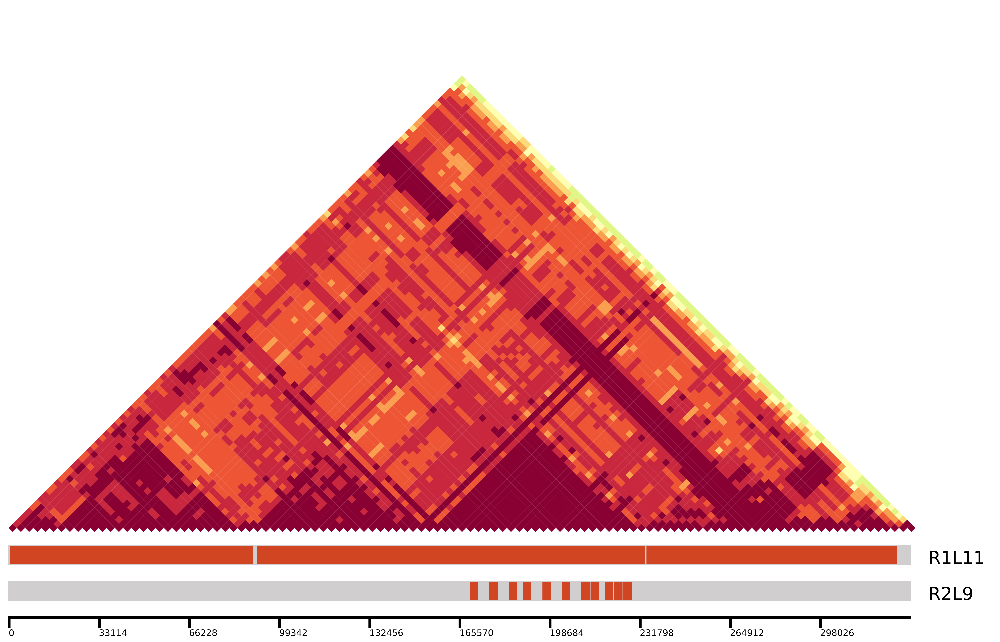

[](https://zenodo.org/badge/latestdoi/558735701) [](https://doi.org/10.1186/s13059-023-02900-5)
# HiCAT: Hierarchical Centromere structure AnnoTation Tool

Advanced long-read sequencing technologies have revolutionized genome assembly, unlocking the complex region centromere and signaling the new stage in genomics research. The new computing problems generated by these new areas, like centromere annotation problem, required novel bioinformatics methods. Here, we proposed HiCAT, a generalized computational tool based on hierarchical tandem repeat mining (HTRM) method to automatically process centromere annotation.
## Dependencies
Python 3.9.13

Packages  | Version |
--------- | --------|
biopython  | 1.79 |
setuptools  | 61.2.0 |
joblib  | 1.1.0 |
numpy  | 1.22.3 |
pandas  | 1.4.0 |
python-levenshtein  | 0.12.2 |
python-edlib  | 1.3.9 |
networkx  | 2.7.1 |
matplotlib  | 3.5.1 |

StringDecomposer (https://github.com/ablab/stringdecomposer) with version 1.1.2.   
Development environment: Linux  
Development tool: Pycharm  

## Installation and Quick start
#### Please use just the `centromere DNA sequence` rather than the whole chromosome sequence.
#### Source code (g++ version 5.3.1 or higher for stringdecomposer)
```Bash
#install
conda install -y --file requirements.txt
cd ./stringdecomposer && make
#run
python HiCAT.py -i ./testdata/cen21.fa -t ./testdata/AlphaSat.fa
#For more details, please use
python HiCAT.py -h
HiCAT: automated annotation centromere

optional arguments:
  -h, --help            show this help message and exit
  -i INPUT_FASTA, --input_fasta INPUT_FASTA
                        centromere DNA sequence in fasta format
  -t MONOMER_TEMPLATE, --monomer_template MONOMER_TEMPLATE
                        monomer template DNA sequence in fasta format for stringdecomposer to build block
  -o OUTPUT_DIR, --output_dir OUTPUT_DIR
                        HiCAT output path default is ./HiCAT_out
  -ms MIN_SIMILARITY, --min_similarity MIN_SIMILARITY
                        The lower bound for similarity threshold which used to remove edges in block graph, default is 0.94
  -st STEP, --step STEP
                        The similarity threshold iteratively increases from min_similarity to nearly 1 with a specific step, default is
                        0.005
  -mh MAX_HOR_LEN, --max_hor_len MAX_HOR_LEN
                        An upper bound for the length of the tandem repeat unit by default 40 monomers for improving efficiency
  -sp SHOW_HOR_NUMBER, --show_hor_number SHOW_HOR_NUMBER
                        Default visualized the top five HORs
  -sn SHOW_HOR_MIN_REPEAT_NUMBER, --show_hor_min_repeat_number SHOW_HOR_MIN_REPEAT_NUMBER
                        Default visualized the HORs with repeat numbers greater than 10
  -th THREAD, --thread THREAD
                        The number of threads, default is 1
```
#### Conda 
```Bash
#install
conda install -c xjtuomics hicat
#run
hicat -i ./testdata/cen21.fa -t ./testdata/AlphaSat.fa
#For more details, please use
hicat -h
```
### Output

```Bash
Example in ./HiCAT_out (run testRunHiCAT.sh)
+ final_decomposition.tsv: the result of stringdecomposer.
+ out_block.sequences: block sequence.
+ out_all_layerX.xls: the annotation in all layer. X is similarity number, 0 is 0.94 and 1 is 0.945 in default. Label "top" represent this region is in top layer. Label "cover" represent this region is covered by a top layer region.
e.g. out_all_layer6.xls 
(start in block sequence, end in block sequence, repeat number, pattern in monomer sequence format, type)
4       528     47      10_9_8_4_7_6_5_4_3_2_1  top
436     443     2       4_7_6_5 cover
462     469     2       4_7_6_5 cover
+ out_top_layerX.xls: the annotation in top layer. 
e.g. out_top_layer6.xls 
(start in block sequence, end in block sequence, repeat number, pattern in monomer sequence format)
4       528     47      10_9_8_4_7_6_5_4_3_2_1
538     1374    66      2_1_10_9_8_4_7_6_5_4_3
1379    1920    48      4_7_6_5_4_3_2_1_10_9_8
+ out_monomer_seq_X.xls: monomer sequence. 
+ out_final_horX.xls: HOR patterns.
+ out_cluster_X.xls: monomer communities.
+ out: The final largest HOR coverage results.
    + hor.repeatnumber.xls: the repeat number of HORs.
    + out_all_layer.xls: The annotation in all layer.
    (HOR name, start in input sequence, end in input sequence, repeat number, pattern in monomer sequence format, type)
    R1L11   569     89810   47      10_9_8_4_7_6_5_4_3_2_1  top
    R4L4    74008   75367   2       4_7_6_5 cover
    R4L4    78428   79787   2       4_7_6_5 cover
    + out_top_layer.xls: the annotation in top layer. 
    (HOR name, start in input sequence, end in input sequence, repeat number, pattern in monomer sequence format)
    R1L11   569     89810   47      10_9_8_4_7_6_5_4_3_2_1
    R1L11   91344   233581  66      2_1_10_9_8_4_7_6_5_4_3
    R1L11   234261  326383  48      4_7_6_5_4_3_2_1_10_9_8
    + out_hor.raw.fa: HOR DNA sequences. Each sequence named as HORname::start-end::strand.
    + out_hor.normal.fa: Normalized HOR DNA sequence. 
    We normalized the raw DNA sequence to one represent HOR. 
    For example, 10_9_8_4_(7_6_5_4_7_6_5_4)_3_2_1 to 1_2_3_4_5_6_7_4_8_9_10 in CEN21.
    + pattern_static.pdf: Bar plot of HOR repeat number.
    + pattern_static.xls: HOR repeat number.
    + plot_pattern.pdf: the location distribution of HOR annotation.

```

### Visualization
HiCAT default visualized the top five HORs with repeat numbers greater than 10 in maximum HOR coverage similarity. 

```Bash
Custom visualization can use visualization.py
-r is HiCAT result directory. e.g. ./HiCAT_out
-s is which similarity be visualized. For example, 0 represents 0.94, 1 represents 0.945 and 2 represents 0.95 in default.
-m is the moddotplot software output bed file. Optional. If the parameter is not provided, the triangular heatmap will not be generated.
-w is the window size used to generate moddotplot bed file. default is 5000.
-sp is the number of top HORs. default is 5.
-sn is the minimum repeat number of HOR. default is 10.
```
The triangle heatmap example on CHM13 centromere 21 is as following:


HiCAT default output the largest HOR coverage results. e.g. ./HiCAT_out/out

```Bash
Custom can use getSingleSimilarityResult.py
-r is HiCAT result directory. e.g. ./HiCAT_out
-s is which similarity be visualized. For example, 0 represents 0.94, 1 represents 0.945 and 2 represents 0.95 in default.
-sp is the number of top HORs. default is 5.
-sn is the minimum repeat number of HOR. default is 10.
```

## Update
```Bash
+ 2023.03.29: adding the strand information in output. strand is defined by compared with input template DNA sequence.
+ 2025.03.21: The hierarchical tandem repeat mining method has been updated, improving the continuity and coverage of the results. The visualization section has also been enhanced with the addition of triangular heatmaps.
```


## Contact
If you have any questions, please feel free to contact: gaoxian15002970749@163.com, xfyang@xjtu.edu.cn, kaiye@xjtu.edu.cn

## Reference
Please cite the following paper when you use HiCAT in your work

Gao, S., Yang, X., Guo, H. et al. HiCAT: a tool for automatic annotation of centromere structure. Genome Biol 24, 58 (2023). https://doi.org/10.1186/s13059-023-02900-5


